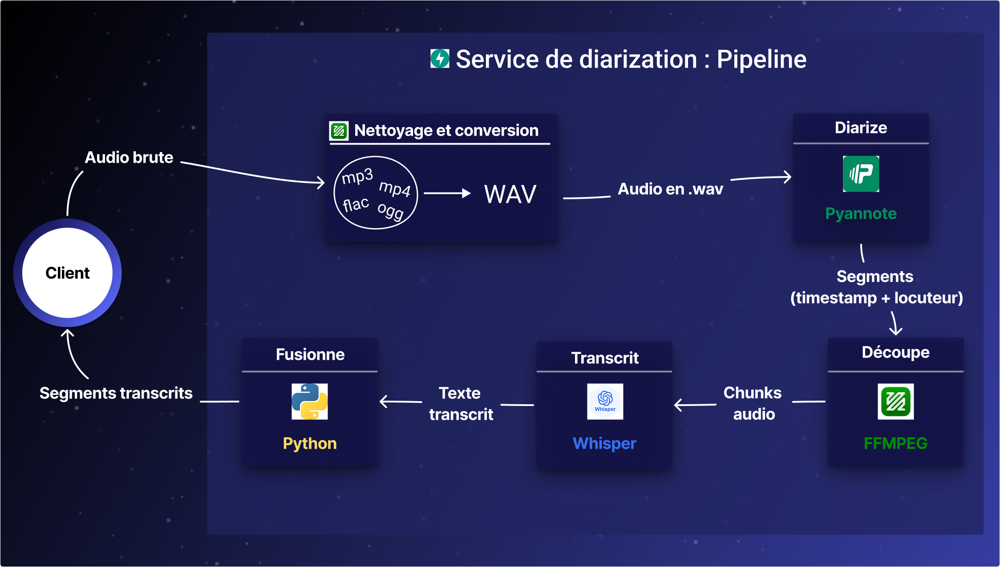

# Service de diarization

Ce script permet d'exposer un service de retranscription avec une segmentation des locuteurs (diarization). Il utilise les modèles suivants : 
- **Pyannote** pour la diarization et **Whisper** pour la transcription.

## Sommaire

- [Pipeline du service](#pipeline-du-service)
    - [Schema du pipeline](#schema-du-pipeline)
    - [Technologies utilisées](#technologies-utilisées)
- [Lancer le service](#lancer-le-service)
    - [Docker](#docker)
    - [En local](#en-local)

## Pipeline du service

Pour procéder à la diarization d'un audio, le service suit le pipeline suivant : 

- Etape 1 : Sauvegarde du fichier uploadé dans un fichier temporaire
- Etape 2 : Conversion et nettoyage de l'audio avec ffmpeg
- Etape 3 : Diarization avec pyannote.

A l'issue de cette étape on se retrouve avec une liste de segments de la forme 

```
segments = [
    {
        "start_time": 0.0,
        "end_time": 5.0,
        "speaker": "Speaker_01",
        "segment": 1,
        "text": ""
    },
    {
        "start_time": 5.0,
        "end_time": 10.0,
        "speaker": "Speaker_02",
        "segment": 2,
        "text": "" 
    },
    ...
]
```
Il est possible que pyannote segmente la parole d'un même speaker en plusieurs segments consécutifs, c'est pourquoi on effectue une étape de fusion ( merging) pour regrouper les segments consécutifs du même speaker en un seul segment plus long.

- Etape 4 : Fusionne les segments consécutifs du même speaker en un seul segment plus long

Exemple : 

```
segments = [
    {
        "start_time": 0.0,
        "end_time": 10.0,
        "speaker": "Speaker_01",
        "segment": 1,
        "text": ""
    },
    {
        "start_time": 10.0,
        "end_time": 15.0,
        "speaker": "Speaker_01",
        "segment": 2,
        "text": ""
    },
    ...
]
```

Devient : 

```
segments = [
    {
        "start_time": 0.0,
        "end_time": 15.0,
        "speaker": "Speaker_01",
        "segment": 1,
        "text": ""
    },
    ...
]
```

- Etape 5 : Pour chaque segment de parole identifié, on extrait le segment audio correspondant et on le transcrit avec whisper
- Etape 6 : On retourne la liste des segments avec les timestamps, les speakers et les textes transcrits

### Schema du pipeline



### Technologies utilisées
- **FastAPI** : Librarie pour créer une API REST pour exposer le service de diarization
- **Pyannote** : Pour segmenter les locuteurs dans un fichier audio
- **Whisper** : Modèle de transcription pour transcrire des segments audio
- **Ffmpeg** : Outil de traitement audio pour convertir et nettoyer les fichiers audio

## Lancer le service

### Prérequis

### Docker

### En local